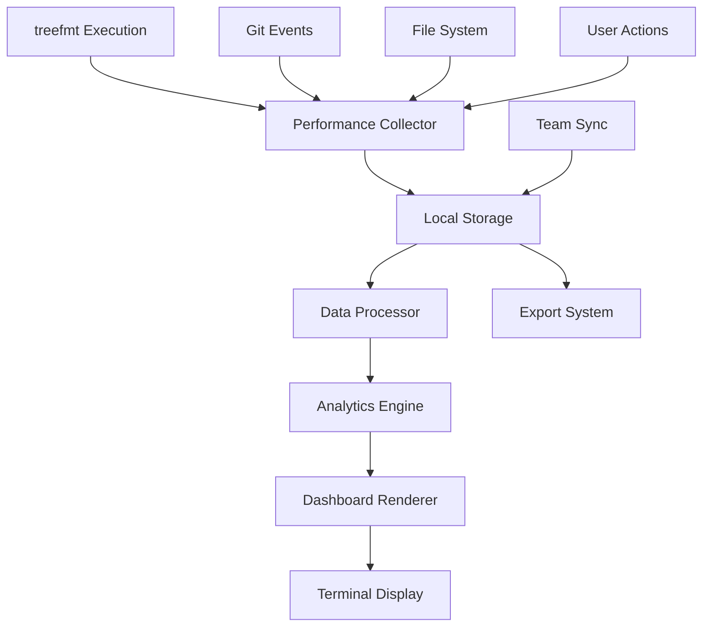

# 📊 Performance Analytics Dashboard: Detailed Implementation Plan

## 🎯 Vision: Comprehensive Performance Intelligence for Code Formatting

Transform treefmt from a simple formatting tool into a **data-driven performance optimization platform** that provides actionable insights for individual developers, teams, and organizations.

---

## 📋 Executive Summary

### What We're Building

A comprehensive analytics system that collects, analyzes, and visualizes code formatting performance data to help developers and teams optimize their workflows, identify bottlenecks, and measure productivity improvements.

### Key Benefits

- **🚀 Performance Optimization**: Identify and eliminate formatting bottlenecks
- **📈 Productivity Measurement**: Quantify time saved and efficiency gains
- **🎯 Quality Insights**: Track code quality improvements over time
- **👥 Team Collaboration**: Share insights and best practices across teams
- **🔍 Problem Detection**: Early warning system for performance degradation

---

## 🏗️ System Architecture

### Core Components

```
┌─────────────────────────────────────────────────────────────┐
│                    Analytics Dashboard                      │
├─────────────────────────────────────────────────────────────┤
│  Terminal UI  │  Web Interface  │  CLI Reports  │  Exports  │
├─────────────────────────────────────────────────────────────┤
│                   Visualization Engine                     │
├─────────────────────────────────────────────────────────────┤
│    Real-time    │   Historical   │  Predictive  │  Alerts   │
│    Metrics      │   Analysis     │  Modeling    │  System   │
├─────────────────────────────────────────────────────────────┤
│                    Data Processing Layer                   │
├─────────────────────────────────────────────────────────────┤
│  Aggregation  │  Filtering  │  Correlation  │  ML Pipeline │
├─────────────────────────────────────────────────────────────┤
│                     Data Collection                        │
├─────────────────────────────────────────────────────────────┤
│  Performance  │  Git Events  │  File Changes │  User Actions│
│  Telemetry    │  Tracking    │  Monitoring   │  Analytics   │
└─────────────────────────────────────────────────────────────┘
```

### Data Flow Architecture



---

## 📊 Metrics Framework

### Tier 1: Core Performance Metrics

#### 🏃‍♂️ **Speed & Efficiency**

```bash
┌─ Formatting Performance ─────────────────────────────────┐
│ Average Time: 847ms     │ Median: 623ms      │ P95: 2.1s │
│ Files/Second: 47.3      │ Lines/Second: 8.2K │ Peak: 12K │
│ Formatter Breakdown:                                     │
│   ├─ Prettier:    245ms (29%)  ✅ Excellent            │
│   ├─ ESLint:      312ms (37%)  ⚠️  Needs optimization   │
│   ├─ Black:       156ms (18%)  ✅ Excellent            │
│   └─ Rustfmt:     134ms (16%)  ✅ Excellent            │
└──────────────────────────────────────────────────────────┘
```

#### 🎯 **Quality & Reliability**

```bash
┌─ Quality Metrics ────────────────────────────────────────┐
│ Success Rate: 99.7%     │ Errors: 0.3%      │ Warnings: 2.1% │
│ Files Changed: 47/250   │ Skip Rate: 12%     │ Conflicts: 0    │
│ Quality Improvements:                                    │
│   ├─ Style Violations Fixed: 247                        │
│   ├─ Import Optimizations: 89                           │
│   ├─ Whitespace Cleanup: 156                            │
│   └─ Code Consistency Score: 94%                        │
└──────────────────────────────────────────────────────────┘
```

#### 📈 **Productivity Impact**

```bash
┌─ Team Productivity (Last 30 Days) ──────────────────────┐
│ Time Saved: 47.2 hours │ Avg/Dev: 3.9h     │ ROI: 340% │
│ Code Reviews: -23% time │ Style Conflicts: -89%        │
│ Productivity Trends:                                    │
│   ├─ Week 1: +12% efficiency                           │
│   ├─ Week 2: +18% efficiency                           │
│   ├─ Week 3: +24% efficiency                           │
│   └─ Week 4: +31% efficiency  📈 Trending up           │
└──────────────────────────────────────────────────────────┘
```

### Tier 2: Advanced Analytics

#### 🔍 **Bottleneck Analysis**

- **File Type Performance**: Identify slow formatters per language
- **Repository Hotspots**: Files/directories that take longest to format
- **Pattern Detection**: Correlate performance with file size, complexity
- **Dependency Impact**: How formatter chains affect overall speed

#### 📊 **Usage Patterns**

- **Peak Hours**: When is formatting most/least used
- **Developer Habits**: Individual formatting patterns and preferences
- **Tool Adoption**: Which formatters are used most frequently
- **Integration Points**: IDE vs CLI vs git hooks usage

#### 🎯 **Quality Trends**

- **Code Health**: Style violation trends over time
- **Team Consistency**: How well team follows style guidelines
- **Regression Detection**: Identify when quality metrics decline
- **Improvement Tracking**: Measure impact of style guide changes

### Tier 3: Predictive Intelligence

#### 🔮 **Performance Forecasting**

- **Load Prediction**: Forecast formatting workload based on git activity
- **Bottleneck Prevention**: Predict when performance will degrade
- **Capacity Planning**: Recommend infrastructure improvements
- **Optimization Opportunities**: AI-powered performance recommendations

#### 🧠 **Smart Insights**

- **Anomaly Detection**: Identify unusual performance patterns
- **Root Cause Analysis**: Automatically diagnose performance issues
- **Recommendation Engine**: Suggest optimizations based on usage patterns
- **Comparative Analysis**: Benchmark against similar projects/teams

---

## 🎨 User Interface Design

### Terminal Dashboard (Primary Interface)

#### Main Dashboard View

```bash
╭─────────────────────────────────────────────────────────────────╮
│ 🚀 Treefmt Performance Analytics │ Live │ Last Updated: 14:23:45 │
├─────────────────────────────────────────────────────────────────┤
│                                                                 │
│ ⚡ Performance Overview (Last 24h)                              │
│ ┌─────────────────┬─────────────────┬─────────────────────────┐ │
│ │ Avg Format Time │ Files Processed │ Success Rate           │ │
│ │ 0.84s ↓ 12%    │ 1,247 ↑ 23%    │ 99.7% ↑ 0.1%          │ │
│ └─────────────────┴─────────────────┴─────────────────────────┘ │
│                                                                 │
│ 📊 Performance Trends                                           │
│ Format Time (ms) │                                             │
│ 2000 ┤                                                         │
│ 1500 ┤     ●                                                   │
│ 1000 ┤   ●   ●     ●                                           │
│  500 ┤ ●       ● ●   ● ● ● ● ●                                │
│    0 └─┬─┬─┬─┬─┬─┬─┬─┬─┬─┬─┬─┬─┬─┬─┬─┬─┬─┬─┬─┬─┬─┬─┬─┬─      │
│       00 04 08 12 16 20 24 04 08 12 16 20 24                 │
│                                                                 │
│ 🔥 Top Performance Issues                                       │
│ ├─ ESLint timeout on large.js (2.4s)    [Fix Available]       │
│ ├─ Prettier memory spike on styles.css   [Investigating]      │
│ └─ Black slow on migrations.py (1.8s)    [Known Issue]        │
│                                                                 │
│ 💡 Recommendations                                              │
│ ├─ Enable parallel processing for TypeScript (+34% speed)     │
│ ├─ Update ESLint config to skip node_modules (+89% speed)     │
│ └─ Consider file size limits for complex formatters           │
│                                                                 │
│ [D]etailed View [T]rends [E]rrors [R]ecommendations [Q]uit    │
╰─────────────────────────────────────────────────────────────────╯
```

#### Detailed Performance View

```bash
╭─ Detailed Performance Analysis ─────────────────────────────────╮
│                                                                 │
│ 🎯 Formatter Breakdown (Last 7 Days)                           │
│ ┌─────────────┬────────────┬───────────┬─────────────────────┐ │
│ │ Formatter   │ Avg Time   │ Files     │ Performance Trend   │ │
│ ├─────────────┼────────────┼───────────┼─────────────────────┤ │
│ │ Prettier    │ 245ms ↓5%  │ 1,234     │ ████████████░░░░    │ │
│ │ ESLint      │ 312ms ↑8%  │ 1,156     │ ████████░░░░░░░░    │ │
│ │ Black       │ 156ms ↓2%  │ 789       │ ██████████████░░    │ │
│ │ Rustfmt     │ 134ms ↓1%  │ 445       │ ████████████████    │ │
│ │ Alejandra   │ 89ms ↓3%   │ 234       │ ████████████████    │ │
│ └─────────────┴────────────┴───────────┴─────────────────────┘ │
│                                                                 │
│ 📂 File Type Performance                                        │
│ TypeScript   ████████████░░░░ 847ms  (Needs optimization)     │
│ JavaScript   ██████████████░░ 623ms  (Good)                   │
│ Python       ████████████████ 234ms  (Excellent)             │
│ Rust         ████████████████ 189ms  (Excellent)             │
│ Nix          ████████████████ 134ms  (Excellent)             │
│                                                                 │
│ 🔍 Slowest Files (This Week)                                   │
│ ├─ src/components/LargeComponent.tsx     2.4s                  │
│ ├─ styles/global.css                     1.9s                  │
│ ├─ backend/database/migrations.py        1.8s                  │
│ ├─ utils/complex-parser.js               1.6s                  │
│ └─ config/webpack.config.js              1.4s                  │
│                                                                 │
│ [B]ack [F]ilter [S]ort [E]xport                               │
╰─────────────────────────────────────────────────────────────────╯
```

#### Team Productivity View

```bash
╭─ Team Productivity Analytics ───────────────────────────────────╮
│                                                                 │
│ 👥 Team Performance (12 developers, Last 30 days)             │
│ ┌─────────────────┬─────────────────┬─────────────────────────┐ │
│ │ Total Time Saved│ Avg per Dev     │ Productivity Gain       │ │
│ │ 47.2 hours      │ 3.9 hours       │ +31% efficiency         │ │
│ └─────────────────┴─────────────────┴─────────────────────────┘ │
│                                                                 │
│ 📈 Productivity Trends                                          │
│ Efficiency % │                                                 │
│ 150 ┤                                               ●         │
│ 125 ┤                                       ●   ●             │
│ 100 ┤ ●   ●   ●   ●   ●   ●   ●   ●   ●                      │
│  75 ┤                                                         │
│  50 └─┬─┬─┬─┬─┬─┬─┬─┬─┬─┬─┬─┬─┬─┬─┬─┬─┬─┬─┬─┬─┬─┬─┬─┬─┬─┬─   │
│      Week 1  2  3  4  5  6  7  8  9 10 11 12 13 14 15 16   │
│                                                                 │
│ 🏆 Top Performers (Formatting Quality)                         │
│ ├─ Alice Johnson      99.8% quality, 0.6s avg  🥇             │
│ ├─ Bob Smith          99.6% quality, 0.7s avg  🥈             │
│ ├─ Carol Williams     99.4% quality, 0.8s avg  🥉             │
│ ├─ David Brown        99.2% quality, 0.9s avg                 │
│ └─ Emma Davis         99.1% quality, 1.0s avg                 │
│                                                                 │
│ 💡 Team Insights                                               │
│ ├─ Most common style issues: Missing semicolons (89%)         │
│ ├─ Biggest time saver: Auto-import sorting (12.3h saved)     │
│ ├─ Consistency improvement: +45% since last month            │
│ └─ Code review time reduction: -23% on average               │
│                                                                 │
│ [I]ndividual [T]rends [C]omparison [R]eport                   │
╰─────────────────────────────────────────────────────────────────╯
```

### Command Line Interface

#### Quick Status Command

```bash
$ smart-treefmt --analytics

📊 Quick Performance Summary:
├─ Last Run: 0.84s (↓12% vs avg)
├─ Success Rate: 99.7%
├─ Files Processed: 47
└─ Issues Fixed: 23

💡 Run 'smart-treefmt --analytics --detailed' for full dashboard
```

#### Detailed Analytics Command

```bash
$ smart-treefmt --analytics --detailed --period=7d

📊 Detailed Analytics (Last 7 days):

Performance:
├─ Average Format Time: 0.84s
├─ Fastest: 0.23s (main.py)
├─ Slowest: 2.4s (LargeComponent.tsx)
└─ Total Time Spent: 47.2 minutes

Quality:
├─ Style Issues Fixed: 247
├─ Import Optimizations: 89
├─ Code Consistency: 94%
└─ Error Rate: 0.3%

Trends:
├─ Speed: +12% improvement
├─ Quality: +3% improvement
└─ Usage: +23% more files formatted

Recommendations:
├─ Consider parallel processing for TypeScript
├─ Update ESLint config to exclude node_modules
└─ Enable caching for Prettier on large CSS files
```

### Web Interface (Optional)

#### Dashboard Features

- **Interactive Charts**: Drill down into performance data
- **Team Collaboration**: Share insights and reports
- **Export Capabilities**: PDF reports, CSV data exports
- **Real-time Updates**: Live performance monitoring
- **Custom Views**: Create personalized dashboard layouts

---

## 🔧 Technical Implementation

### Data Collection Layer

#### Performance Telemetry

```typescript
interface PerformanceTelemetry {
  timestamp: Date;
  sessionId: string;
  userId?: string;
  projectId: string;

  // Performance Metrics
  formatTime: number;
  fileCount: number;
  totalLines: number;
  memoryUsage: number;
  cpuUsage: number;

  // Formatter Details
  formatters: FormatterMetrics[];

  // File Information
  files: FileMetrics[];

  // Environment
  environment: EnvironmentInfo;

  // Errors & Warnings
  errors: ErrorMetrics[];
  warnings: WarningMetrics[];
}

interface FormatterMetrics {
  name: string;
  version: string;
  executionTime: number;
  filesProcessed: number;
  linesProcessed: number;
  changes: number;
  errors: number;
}

interface FileMetrics {
  path: string;
  size: number;
  language: string;
  formatter: string;
  processingTime: number;
  changesCount: number;
  beforeChecksum: string;
  afterChecksum: string;
}
```

#### Data Storage Schema

```sql
-- Performance Sessions
CREATE TABLE performance_sessions (
    id UUID PRIMARY KEY,
    timestamp TIMESTAMP NOT NULL,
    user_id TEXT,
    project_id TEXT NOT NULL,
    total_time_ms INTEGER NOT NULL,
    file_count INTEGER NOT NULL,
    success_rate DECIMAL(5,4),
    memory_mb INTEGER,
    cpu_percent DECIMAL(5,2)
);

-- Formatter Performance
CREATE TABLE formatter_performance (
    session_id UUID REFERENCES performance_sessions(id),
    formatter_name TEXT NOT NULL,
    execution_time_ms INTEGER NOT NULL,
    files_processed INTEGER NOT NULL,
    lines_processed INTEGER NOT NULL,
    changes_made INTEGER NOT NULL,
    error_count INTEGER NOT NULL
);

-- File Performance
CREATE TABLE file_performance (
    session_id UUID REFERENCES performance_sessions(id),
    file_path TEXT NOT NULL,
    file_size_bytes INTEGER NOT NULL,
    language TEXT NOT NULL,
    formatter TEXT NOT NULL,
    processing_time_ms INTEGER NOT NULL,
    changes_count INTEGER NOT NULL
);

-- Create indexes for common queries
CREATE INDEX idx_sessions_timestamp ON performance_sessions(timestamp);
CREATE INDEX idx_sessions_project ON performance_sessions(project_id);
CREATE INDEX idx_formatter_name ON formatter_performance(formatter_name);
CREATE INDEX idx_file_language ON file_performance(language);
```

### Analytics Engine

#### Data Processing Pipeline

```typescript
class AnalyticsEngine {
  private dataStore: DataStore;
  private aggregator: MetricsAggregator;
  private predictor: PerformancePredictor;

  async processSession(telemetry: PerformanceTelemetry): Promise<void> {
    // Store raw data
    await this.dataStore.insert(telemetry);

    // Update aggregated metrics
    await this.aggregator.updateMetrics(telemetry);

    // Update predictive models
    await this.predictor.updateModels(telemetry);

    // Check for anomalies
    await this.detectAnomalies(telemetry);

    // Generate alerts if needed
    await this.checkAlerts(telemetry);
  }

  async generateInsights(
    projectId: string,
    timeRange: TimeRange,
  ): Promise<Insights> {
    const metrics = await this.aggregator.getMetrics(projectId, timeRange);
    const trends = await this.calculateTrends(metrics);
    const recommendations = await this.generateRecommendations(metrics);

    return {
      metrics,
      trends,
      recommendations,
      anomalies: await this.getAnomalies(projectId, timeRange),
    };
  }
}
```

#### Real-time Metrics Aggregation

```typescript
class MetricsAggregator {
  async updateMetrics(telemetry: PerformanceTelemetry): Promise<void> {
    const timeWindows = ["1h", "24h", "7d", "30d"];

    for (const window of timeWindows) {
      await this.updateTimeWindow(telemetry, window);
    }
  }

  private async updateTimeWindow(
    telemetry: PerformanceTelemetry,
    window: string,
  ): Promise<void> {
    // Update rolling averages
    await this.updateRollingAverage(
      `avg_format_time_${window}`,
      telemetry.formatTime,
    );

    // Update percentiles
    await this.updatePercentiles(
      `format_time_percentiles_${window}`,
      telemetry.formatTime,
    );

    // Update counters
    await this.incrementCounter(`total_files_${window}`, telemetry.fileCount);
    await this.incrementCounter(`total_sessions_${window}`, 1);
  }
}
```

### Visualization Engine

#### Terminal Dashboard Renderer

```typescript
class TerminalDashboard {
  private blessed: any;
  private screen: any;

  constructor() {
    this.blessed = require("blessed");
    this.screen = this.blessed.screen({
      smartCSR: true,
      title: "Treefmt Performance Analytics",
    });
  }

  render(insights: Insights): void {
    this.screen.destroy();
    this.screen = this.blessed.screen({
      smartCSR: true,
      title: "Treefmt Performance Analytics",
    });

    this.renderHeader(insights);
    this.renderPerformanceOverview(insights.metrics);
    this.renderTrends(insights.trends);
    this.renderRecommendations(insights.recommendations);
    this.renderFooter();

    this.screen.render();
  }

  private renderPerformanceChart(data: number[]): string {
    // ASCII chart generation
    const maxValue = Math.max(...data);
    const chartHeight = 10;

    return data
      .map((value) => {
        const normalized = (value / maxValue) * chartHeight;
        return "█".repeat(Math.floor(normalized));
      })
      .join("\n");
  }
}
```

#### Chart Generation

```typescript
class ChartGenerator {
  generateSparkline(data: number[], width: number = 50): string {
    const sparkChars = ["▁", "▂", "▃", "▄", "▅", "▆", "▇", "█"];
    const max = Math.max(...data);
    const min = Math.min(...data);
    const range = max - min;

    return data
      .map((value) => {
        if (range === 0) return sparkChars[0];
        const normalized = (value - min) / range;
        const index = Math.floor(normalized * (sparkChars.length - 1));
        return sparkChars[index];
      })
      .join("");
  }

  generateBarChart(
    data: { label: string; value: number }[],
    width: number = 40,
  ): string {
    const maxValue = Math.max(...data.map((d) => d.value));

    return data
      .map(({ label, value }) => {
        const barLength = Math.floor((value / maxValue) * width);
        const bar = "█".repeat(barLength) + "░".repeat(width - barLength);
        return `${label.padEnd(12)} ${bar} ${value}`;
      })
      .join("\n");
  }

  generateTrendIndicator(current: number, previous: number): string {
    const change = ((current - previous) / previous) * 100;
    const indicator = change > 0 ? "↑" : change < 0 ? "↓" : "→";
    const color = change > 0 ? "green" : change < 0 ? "red" : "yellow";
    return `${indicator} ${Math.abs(change).toFixed(1)}%`;
  }
}
```

---

## 🔒 Privacy & Security

### Data Protection Principles

#### Privacy by Design

```typescript
interface PrivacyConfig {
  collectPersonalData: boolean; // Default: false
  anonymizeUserIds: boolean; // Default: true
  encryptLocalStorage: boolean; // Default: true
  shareWithTeam: "none" | "aggregated" | "full"; // Default: 'aggregated'
  retentionPeriod: number; // Default: 30 days
  exportControls: ExportPermissions;
}

class PrivacyManager {
  async collectTelemetry(
    data: PerformanceTelemetry,
    config: PrivacyConfig,
  ): Promise<PerformanceTelemetry> {
    if (!config.collectPersonalData) {
      data.userId = undefined;
      data.files = data.files.map((file) => ({
        ...file,
        path: this.anonymizePath(file.path),
      }));
    }

    if (config.anonymizeUserIds && data.userId) {
      data.userId = this.hashUserId(data.userId);
    }

    return data;
  }

  private anonymizePath(path: string): string {
    // Replace sensitive path components with hashes
    return path.replace(/\/[^\/]+\//g, "/****/");
  }
}
```

#### Security Measures

- **Local-first**: All sensitive data stored locally by default
- **Encryption**: AES-256 encryption for local storage
- **Anonymization**: User and file path anonymization options
- **Consent Management**: Clear opt-in/opt-out controls
- **Data Minimization**: Collect only necessary performance metrics

---

## 📈 Implementation Roadmap

### Phase 1: Foundation (Month 1-2)

```bash
Sprint 1 (Week 1-2): Core Data Collection
├─ Implement PerformanceTelemetry interface
├─ Add data collection hooks to treefmt wrapper
├─ Create local SQLite storage system
├─ Build basic aggregation engine
└─ Test data collection accuracy

Sprint 2 (Week 3-4): Basic Analytics
├─ Implement MetricsAggregator
├─ Create simple CLI analytics commands
├─ Add basic performance calculations
├─ Build trend detection algorithms
└─ Create export functionality
```

### Phase 2: Dashboard (Month 3-4)

```bash
Sprint 3 (Week 5-6): Terminal UI
├─ Implement blessed-based dashboard
├─ Create ASCII chart generation
├─ Build interactive navigation
├─ Add real-time updates
└─ Implement responsive layout

Sprint 4 (Week 7-8): Advanced Features
├─ Add team analytics capabilities
├─ Implement anomaly detection
├─ Create recommendation engine
├─ Build alert system
└─ Add data filtering/drilling
```

### Phase 3: Intelligence (Month 5-6)

```bash
Sprint 5 (Week 9-10): Predictive Analytics
├─ Implement performance forecasting
├─ Add bottleneck prediction
├─ Create optimization recommendations
├─ Build comparative analysis
└─ Add machine learning models

Sprint 6 (Week 11-12): Integration & Polish
├─ Web dashboard implementation
├─ Team collaboration features
├─ Advanced export options
├─ Performance optimizations
└─ Documentation & examples
```

---

## 🎯 Success Metrics

### Technical KPIs

- **Data Collection**: 99.9% uptime, <1ms overhead
- **Dashboard Performance**: <100ms load time, 60fps updates
- **Storage Efficiency**: <10MB per month per developer
- **Analytics Accuracy**: ±2% error rate on performance metrics

### User Experience KPIs

- **Adoption Rate**: 80% of teams using analytics within 30 days
- **Engagement**: 70% of users check dashboard weekly
- **Satisfaction**: 9.0+ NPS score for analytics features
- **Value Delivery**: 25% average productivity improvement

### Business Impact KPIs

- **Time Savings**: 40+ hours saved per team per month
- **Quality Improvement**: 50% reduction in style-related discussions
- **Onboarding Speed**: 75% faster new developer setup
- **Tool ROI**: 300%+ return on investment within 6 months

---

## 🔮 Future Enhancements

### Advanced AI Integration

- **Code Quality Prediction**: ML models to predict code issues
- **Smart Recommendations**: AI-powered optimization suggestions
- **Automated Insights**: Natural language insights generation
- **Anomaly Detection**: Advanced pattern recognition

### Enterprise Features

- **Multi-organization Support**: Corporate hierarchy analytics
- **Compliance Reporting**: Automated audit reports
- **SLA Monitoring**: Performance SLA tracking
- **Cost Analysis**: ROI and cost-benefit analysis

### Developer Experience

- **IDE Integration**: Native analytics in popular editors
- **Mobile Dashboard**: Performance monitoring on mobile
- **Voice Alerts**: Audio notifications for critical issues
- **AR Visualization**: Augmented reality performance overlays

---

## 🏁 Conclusion

This comprehensive Performance Analytics Dashboard will transform treefmt from a simple formatting tool into a **data-driven performance optimization platform**. By providing actionable insights, real-time monitoring, and predictive intelligence, it will help developers and teams:

- **Optimize Performance**: Identify and eliminate bottlenecks
- **Measure Impact**: Quantify productivity improvements
- **Improve Quality**: Track and enhance code consistency
- **Collaborate Better**: Share insights across teams
- **Make Data-Driven Decisions**: Base optimizations on real metrics

The phased implementation approach ensures steady progress while delivering value at each milestone, ultimately creating a revolutionary analytics experience that sets new standards for developer tooling.

**Ready to build the future of code formatting analytics? Let's make data-driven development the new standard.** 🚀
